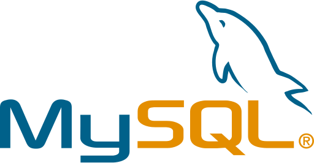

### Holaa 👋🏼 soy Samanta

### ✏ Acerca de mí

"Soy Ingeniera en Telecomunicaciones 📡 y Desarrolladora Backend Jr, con experiencia en Desarrollo Frontend recién adquirida 👩🏻‍💻. Apasionada por aprender y amante de los desafíos."

### 🔧 Lenguajes y herramientas

### 📈 Mis estadisticas
 

### 📞 Contáctame

<!--

LENGUAJES

     

  dark, radical, merko, gruvbox, tokyonight, onedark, cobalt, synthwave, highcontrast, dracula

   

| col 1 | col 2 |
| ------------ | ------------- |
| imagen 1 | imagen 2 |

**sami1793/sami1793** is a ✨ _special_ ✨ repository because its `README.md` (this file) appears on your GitHub profile.

Here are some ideas to get you started:

- 🔭 I’m currently working on ...
- 🌱 I’m currently learning ...
- 👯 I’m looking to collaborate on ...
- 🤔 I’m looking for help with ...
- 💬 Ask me about ...
- 📫 How to reach me: ...
- 😄 Pronouns: ...
- ⚡ Fun fact: ...
-->
